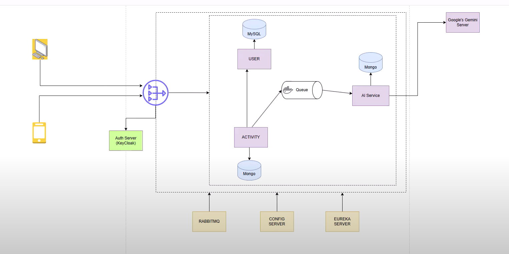

"# ai_fitness_sb-react" 

SpringBoot - backend
react - frontend

- fully featured microservices arch fitness app
 - AI integration in microservices

 microservice  - each microservice not dependent on each other can work individually 

Tech Stack 
Spring Boot - backend
Eureka Server - 
Spring Cloud Gateway
KeyCloak - security authentication
RabbitMQ - Asynchronous comm
PostGresSql/Mysql - database
google gemini api
spring cloud config server

client(accessing rest api) - 3 microservices accessed by api gateway - api gateway routing request to the required microservice - security key cloak (Oauth) issuing jwt tokens -
api gateway authenticates request issues a token to the frontend given to client once it is validated routed to requiredd microservices - user(user deets) - AIservice( getting from gemini model) - activity(like jumping jacks etc)

has both asnync and sync comm
ex sync  - activity to user

ex async activity to ai service using message queue

rabbitmq - queues asnyc
config server - central repo for all the configs
eureka server - service discovery   